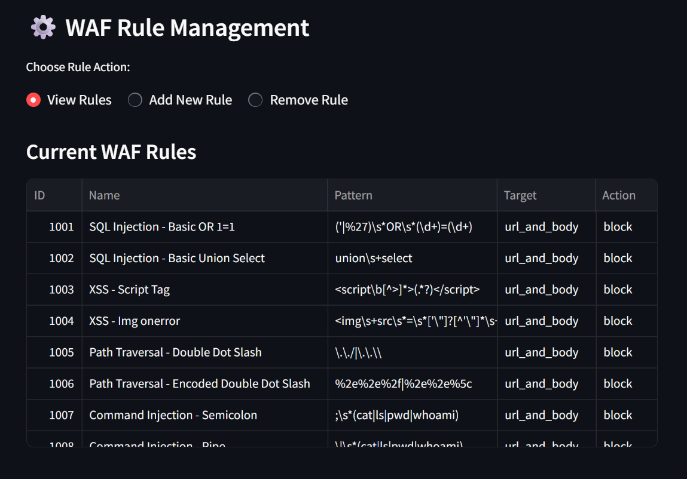

# 🛡️ SimpleWAF: A Web Application Firewall Simulator

A simplified, interactive Web Application Firewall (WAF) simulator built with **Python** and **Streamlit**. This project demonstrates core WAF principles by inspecting simulated HTTP requests against a configurable set of security rules to detect common web vulnerabilities like **SQL Injection**, **Cross-Site Scripting (XSS)**, and **Path Traversal**.

---

## 🚀 Introduction

In today's digital landscape, web applications are constant targets for malicious attacks. A **Web Application Firewall (WAF)** acts as a crucial defensive layer, protecting applications by filtering and monitoring HTTP traffic.

**SimpleWAF** provides a hands-on platform to understand how WAFs function. It allows you to:

- Simulate various HTTP requests, including both clean and malicious payloads.
- Observe how pre-defined WAF rules (based on common attack signatures) are applied.
- Manage rules dynamically and see their immediate effect on detection capabilities.

This project highlights practical skills in **defensive cybersecurity**, **threat detection**, and **application security**.

---

## ✨ Features

- **Request Simulation:** Simulate GET and POST HTTP requests with custom URLs and request bodies.
- **Rule-Based Detection:** Inspects requests using regex-based rules to catch:
  - SQL Injection (SQLi)
  - Cross-Site Scripting (XSS)
  - Path Traversal / Directory Traversal
  - Command Injection
- **Dynamic Rule Management:** Add new custom rules or remove existing ones via the UI.
- **Interactive UI:** Built with Streamlit for a clean and intuitive web interface.
- **Clear Feedback:** Visual feedback shows whether a request is clean or a threat, with rule details.

---

## 📸 Preview

 
 

---

## 🛠️ Tech Stack

- **Python** – Core programming language
- **Streamlit** – For building the interactive frontend
- **re** – Python's regular expression module

---

## ✍️ Usage Examples

### ✅ Clean Request

- **Request Type:** `GET`  
- **URL:** `/products?category=electronics&item=laptop`  
- **Expected Output:**  `"Request Clean! No immediate threats detected."` 

---

### ❌ SQL Injection

- **Request Type:** `GET`  
- **URL:** `/login?username=admin' OR 1=1--&password=foo`  
- **Expected Output:**  `"THREAT DETECTED!" (Rule ID 1001 or 1010 will likely trigger)`

---

### ❌ XSS Attempt

- **Request Type:** `GET`  
- **URL:** `/search?query=<script>alert('XSS');</script>`  
- **Expected Output:**  `"THREAT DETECTED!" (Rule ID 1003 or 1009 will likely trigger)`

---

### ❌ Path Traversal

- **Request Type:** `GET`  
- **URL:** `/download?file=../../../../etc/passwd`  
- **Expected Output:**  `"THREAT DETECTED!" (Rule ID 1005 or 1006 will likely trigger)`

---

### ➕ Adding a Custom Rule

1. Navigate to **Manage WAF Rules** in the UI.
2. Click **Add New Rule**.
3. Fill in the following details:
 - **Rule ID:** `2001`
 - **Name:** `Detect Malicious User Agent`
 - **Pattern:** `evil-bot-agent`
 - **Action:** `block`
4. Click **Add Rule**.
5. Test with a GET request like:  
 `/info?user-agent=evil-bot-agent`

---

## 💡 Skills Demonstrated

- **Web Security** – Understanding of WAF principles and common vulnerabilities (SQLi, XSS, etc.)
- **Defensive Programming** – Implementing detection mechanisms
- **Regex Mastery** – Using regular expressions for pattern matching
- **Python** – Modular, object-oriented programming
- **UI Design** – Creating intuitive UIs with Streamlit
- **Automation** – Simulating and inspecting HTTP request flows
- **Problem Solving** – Addressing real-world security issues

---

## 📈 Future Enhancements

- 🔄 **Real Server Integration:** Use with Flask or FastAPI  
- 📊 **Advanced Rules:** Add rule scoring and anomaly detection  
- 📥 **Inspect Headers/JSON:** Expand rule coverage  
- 💾 **Rule Persistence:** Save/load rules from JSON/YAML  
- 📜 **Detailed Logs:** Track clean and blocked requests  
- 📉 **Visualization:** Charts for rule hits and attack types  
- 🤖 **ML Integration:** Detect threats using AI/ML

---

## 📦 Getting Started

### Prerequisites

- Python 3.8+
- `pip` (usually included with Python)

### Installation

```bash
git clone https://github.com/shivangi1612/simplewaf.git
cd SimpleWAF
